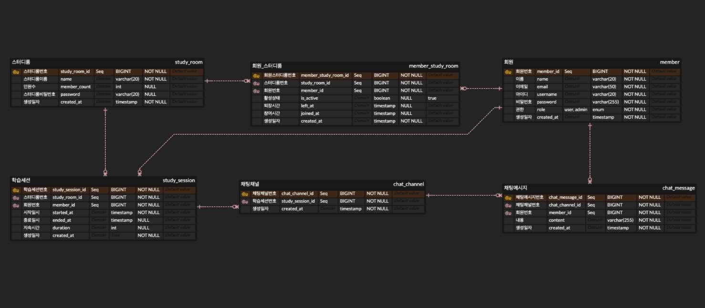

## DB Schema

### ERD 구조도

### 개요

온라인 스터디룸 서비스의 데이터베이스 스키마

### 주요 설계 결정사항
1. **비밀번호 해싱**: VARCHAR(255)로 bcrypt 해시 저장
2. **공부 시간 추적**: study_session의 started_at, ended_at으로 계산
3. **채팅 구조**: study_session마다 chat_channel 생성
